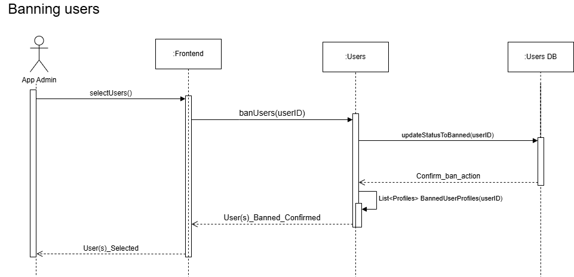

# M3 - TrailBlazers Requirements and Design
####  William Sun, Yu Qian Yi, Amanvir Samra, Alfredo del Rayo

## 1. Change History
 - Updated Dependency Diagram to show link between userDB and user Component 03/08/2025
 - Updated the Messaging interface to align to implementation. 03/14/2025
 - Updated Usecase diagram and Functional Requirement names to align to use cases. 03/15/2025
 - Updated Dependency Diagram to show link between userDB and user Component. 02/14/2025
 - Functional Requirement 2 renamed to Sign In from Sign Up. 02/14/2025
 - Updated the functional requirements for Recommend Jogger Buddies. 03/15/2025
 - Updated the main component (interfaces) of Recommendation. 03/21/2025
 - Updated the write up for non functional requirements of Recommendation Usability. 03/21/2025
 - Updated the User interface to align with implementation. 03/21/2025
 - Updated the Authentication use case to align with implementation. 03/21/2025
 - Replaced the non-functional requirement for security with one for performance. 03/21/2025
 - Updated the main complexity project design. 04/01/2025
 - Updated the non-functional requirement for recommendation usability. 04/02/2025

## 2. Project Description
An application that connects nearby users to jog/run together adapting to their schedule and distance willing to travel.

## 3. Requirements Specification
### **3.1. Use-Case Diagram**

<div align="center">

</div>


### **3.2. Actors Description**
1. **User**: A person who uses the app to locate, connect with others users nearby, and update their personal information.
2. **App Admin**: A person who has higher privileges to moderate the app by reviewing reports from users and issues bans to offenders.

### **3.3. Functional Requirements**

1. **Authenticate**:<a id="fr1"></a>
    1. **Sign In**: 
        - **Description**: This feature allows users to sign in to an existing account on the app using Google Sign In API.
        - **Primary actor(s)**: User
        - **Main success scenario**:
            1. User enters credentials in Google Sign In
            2. The system fetches a token for the user
            3. System checks User is in the Database and not banned
            4. Adds new user if not in database
            5. A new session is created for the user
            6. User gets confirmation the Login was successful
        - **Failure scenario(s)**:
            - 3a. Unable to connect to server to check User data in DB
                - 3a1. An error message is displayed telling user of the error
                - 3a2. App prompts user to try again after a set time period
    2. **Sign Out**:
        - **Description**: This feature allows users to log out from the app and close their current session.
        - **Primary actor(s)**: User
        - **Main success scenario**:
            1. User clicks sign out button
            2. System uses User token and sessionID to close user session
            3. User gets confirmation the Sign Out was successful and is taken back to login screen
        - **Failure scenario(s)**:
            - 2a. Unable to connect to close user session due to network problems
                - 2a1. An error message is displayed telling user of the error
                - 2a2. App prompts user to try again after a set time period

2. **Manage profile**:<a id="fr2"></a>
   - **Description**: This feature allows users to update their profile to help personalize their nearby buddy recommendations.
   - **Primary actor(s)**: User
   - **Main success scenario**:
       - 1. User navigates to the profile section.
       - 2. User inputs their personal information and jogging preferences.
       - 3. User clicks on the "Save" button.
       - 4. System updates the user's profile in the database.
   - **Failure scenario(s)**:
       - 2a. Invalid input: 
            - 2a1. System displays error message saying invalid character is entered.
            - 2a2. App prompts user to input valid information.
       - 4b. Network issue: 
            - 4a1. Information are not saved and system displays error message saying "Network error. Please check your internet connection and try again."
            - 4a2. App prompts user to try again after a set time period.

3. **Recommend Jogger Buddies**:<a id="fr3"></a>
    - **Description**: This feature allows users to discover other joggers based on their pace, distance, location and preferred jogging time.
    - **Primary actor(s)**: User
    - **Main success scenario**:
        - 1. User navigates to the "Recommendation" section.
        - 2. User inputs weight for location, speed and distance respetively within number (0-10).
        - 3. User clicks on the "Grant Location Permission" button to allow app to access user's location.
        - 4. User clicks on the "Get Recommendations" button.
        - 5. System retrieves and displays the top 5 joggers matched relevant details (e.g., name, match score, pace, distance, time, availability).
        - 6. User can click the "View on Map" button to view Google Map location that display user's location and joggers nearby (if exists).
        - 7. User can click the "Message" button to direct message jogger (which will lead to chat functionality).
    - **Failure scenario(s)**:
        - 2a. Invalid inputs for weights: 
            - 2a1. System displays message saying "Please enter valid weights (0-10)"
            - 2a2. App prompts user to try again with valid weights.
        - 3a. User did not grant location permission: 
            - 3a1. System displays message saying "Please grant the location permissions"
            - 3a2. App prompts user to try again by granting the location permissions.
        - 5a. No suitable matches are found: 
            - 5a1. System displays message saying "No joggers available for the selected time and location. Please try again later or adjust your preferences."
            - 5a2. App prompts user to try again after adjusting preference.
        - 5b. API call fails: 
            - 5b1. System displays error message saying "Failed to fetch recommendations."
            - 5b2. App prompts user to try again after a set time period.

4. **Message Buddies**:<a id="fr4"></a>
    1. Join/Create to Chat Group
        - **Description**: This feature allows users to join or create a chat group with other users when looking at the profile of other joggers.
        - **Primary Actors**: User(s)
        - **Main Success Scenario**:
            1. User clicks on an User Profile
            2. User sends a connection request or message to create a chat or join a group chat with the jogger.
        - **Failure Scenarios**:
        - 2a. Jogger/Group does not exist: Display "Error: Group/Jogger does not Exist"
        - 2b. User is not logged in: Display "Error: Please Log in again"
        - 3a. Jogger/Group Reports user attempting to join: "Error: Could not connect with Joggers"
    2. Send Messages
        - **Description**: This feature allows users to message other users.
        - **Primary Actors**: User(s)
        - **Main Success Scenario**:
            1. User enters message into textbox and clicks send
            2. System sends the message to the recipient(s)
            3. System confirms to User the message was delivered successfully and updates displayed messages
        - **Failure Scenarios**:
            - 2a. Message can not be sent due to network issues
                - 2a1. An error message is displayed telling user of the error
                - 2a2. User is prompted to try again after a set period of time

5. **Report User**<a id="fr5"></a>:
   - **Description**: Users can report inappropriate behavior or content within the app. This report is sent to the admin panel for further review.
   - **Primary actor(s)**: User
   - **Main success scenario**:
       1. User navigates to the profile or message thread of the offending user.
       2. User selects the "Report" option.
       3. User chooses a reason from a predefined list (e.g., harassment, spam, inappropriate content).
       4. User submits the report.
       5. System confirms submission and stores the report in the database.
       6. Admin is notified of the new report.
   - **Failure scenario(s)**:
       - 1a. No internet connection: Display "Failed to submit report. Please try again."
       - 1b. Report submission error: Display "An error occurred. Please try again later."

6. **Ban User (Admin Side)**:<a id="fr6"></a>
   - **Description**: Admins have the capability to ban users who have been reported for violations, ensuring a safe and friendly community environment.
   - **Primary actor(s)**: App Admin
   - **Main success scenario**:
       1. Admin logs into the admin panel.
       2. Admin reviews a list of reported users with details of the reports.
       3. Admin selects a user to ban.
       4. Admin clicks the "Ban User" button.
       5. System updates the user's status to "Banned" and restricts access to the app.
       6. User receives a notification or email explaining the reason for the ban.
   - **Failure scenario(s)**:
       - 1a. Database error: Display "Failed to ban user. Please try again later."
       - 1b. Unauthorized access: Display "You do not have permission to perform this action."


### **3.4. Screen Mockups**


### **3.5. Non-Functional Requirements**
<a name="nfr1"></a>

1. **Security**  
    - **Description**: The application will ensure that user data and communications are encrypted, and secure protocols (e.g., HTTPS) will be used.
    - **Justification**: Security is a key aspect of any application that handles user data. It ensures that users' personal information is protected from unauthorized access and potential breaches. This is crucial for building trust and maintaining user confidence in the application.
2. **Recommendation Usability** 
    - **Description**: The Find Buddies functionality must ensure that at least one suitable jogging partner is displayed after clicking the "Get Recommendations" button. The system must successfully parse the user's preferences for location, speed, distance, and availability to generate a recommendation.
    - **Justification**: The application must always provide a jogging buddy to maintain usability and user engagement. If no perfect match is found, the system should return the closest available match instead of leaving the user without recommendations. Ensuring a reliable recommendation process improves user satisfaction and trust in the app.


## 4. Designs Specification
The design focuses on enabling the general user to
### **4.1. Main Components** 
1. **Users**
    - **Purpose**: Provide authentication, manage sessions, manage passwords, and ensure users can only access resources they have permission for. 
    - **Interfaces**:
        1. **`{Tkn, admin, banned} Login(String email, String GoogleID)`**:
            - **Purpose**: Returns a valid token to keep session with the user if the user is able to successfully authenticate. Also returns admin boolean, to detect user type and banned boolean, to ensure user has permission to access app.
        2. **`User getUserData(String email)`**:
           - **Purpose**: Retrieves user object corresponding to email, that contains all user data.
        3. **`Void putUserData(String email, String distance, String time, Float pace, Array[] availability)`**:
            - **Purpose**: Updates user object in db that corresponds to the email provided with the distance, time, pace and availability values.
        5. **`int LogoutUser()`**:
            - **Purpose**: Ends user session by invalidating session token.
2. **Messaging** 
    - **Purpose**: Allow users to communicate with potential jogging partners and discuss meeting time, place, etc. and set up groups
    - **Interfaces**: 
        1. **`Chat[] getChats(String email)`**
            - **Purpose**: Retrieve all the chats (without messages and with member count) from the user specified with email.
        2. **`Message[] getMessages(String chatId)`**
            - **Purpose**: Retrieve all messages from the chat specified in ordered by date non-ascending .
        3. **`Message[] getMesagesAfter(String chatId, String messageId)`**
            - **Purpose**: Retrieves all messages of the chat with id chatId whose date is later than the Message with id messageId
        4. **`Tuple(String, String)[] getChatMembers(String chatId)`**:
           - **Purpose**: Retrieves the emails and names of all members of the chat with id chatId. 
        5. **`Chat postChat(String email, String chatName)`**
           - **Purpose**: Creates a new chat with title chatName with a single member.
        6. **`Chat postDMChat(String email, String target_email)`**
            - **Purpose**: Creates a Direct Messaging chat, the title of the chat will show the other member's name and specify that it is a DM. This chat is constrained to two people.
        7. **`Message postMessage(String email, string chatId, string content)`** 
            - **Purpose**: Creates a message with the specified content and user and adds it to the chat with id chatId.
        8.  **`Chat addUser(String email, string chatId)`** 
            - **Purpose**: Adds user with the specified email to the chat.     
3. **Recommendations** 
    - **Purpose**: Provide users with a list of potential jogging partners based on their preferences and location.
    - **Interfaces**: 
        1. **`Recommendation postLocation(Location location, double maxUsers)`**
        - **Purpose**: Post weight of location, speed and distance and pass the weights to findJogBuddies function to retrieve the top 5 recommended joggers.
        2. **`Recommendation postRecommendations(String latitude, String longitude)`**
        - **Purpose**: Post longitude and latitude to update location of user.


### **4.2. Databases**
1. **Users DB**
    - **Purpose**: To store user credentials, running preferences, and running performance.
    - **Representation**: The user database will store the User object which includes both General Users and Admin as depicted in the class diagram below:
<div align="center">

</div>


2. **Messaging DB**
    - **Purpose**: To store chat logs and metadata.
    - **Representation**: The database will store Chat objects as depicted in the following class diagram:

<div align="center">

</div>

3. **Reports DB**
    - **Purpose**: To store reports on certain users committed by other users.
    - **Representation**: The database will store reports on certain users as depicted in the following class diagram:

<div align="center">

</div>


### **4.3. External Modules**
1. **Google Sign in API** 
    - **Purpose**: To provide user authentication service.
1. **Google Map API** 
    - **Purpose**: To provide location services and map functionalities.
    

### **4.4. Frameworks**
1. **Microsoft Azure**
    - **Purpose**: It is our cloud provider, used to host our server.
    - **Reason**: We want to experiment with it and learn about using it as usually it costs a lot of money but we have access to it for free.
2. **MongoDB**
    - **Purpose**: It will be used for our all of our databases
    - **Reason**: It is dynamic and always you to retrieve objects as JSON, additionally MongoDB has better performance than most other database options we have access to.
2. **ExpressJS**
    - **Purpose**: We will use it to build RESTful APIs
    - **Reason**: It allows us to easily and rapidly set up a REST API. Also it is lightweight and works with MongoDB,

### **4.5. Dependencies Diagram**

<div align="center">

</div>


### **4.6. Functional Requirements Sequence Diagram**
1. [**User Authentication**](#fr1)
- [**User Login/Sign up**](#f1)
<div align="center">

</div>

- [**User Sign out**](#fr1)
<div align="center">

</div>

2. [**Update Profile**](#fr2)

<div align="center">

</div>

3. [**Recommend Jogging Buddies**](#fr3)
<div align="center">

</div>

4. [**Join/Create and Send Messages to Chat Group**](#fr4)
- [**Join/Create Chat Group**](#fr4)
<div align="center">

</div>

- [**Send Messages to Chat Group**](#fr4)
<div align="center">

</div>

5. [**Report Users**](#fr5)
<div align="center">

</div>

6. [**Ban Users**](#fr6)
<div align="center">

</div>


### **4.7. Non-Functional Requirements Design**
1. [**Performance: Update user preferences within 5s**](#nfr1)
    - **Validation**: The user should be able to send the updated data to the backend and get a success or failure response within 5s. If the response takes longer than 5s the frontend will throw an error and return a failure message to the user. This will ensure that in case of losing connection, there is a timeout for reconnection attempts.
2. [**Performance: Find Buddies Does must not take more than 15s**](#nfr2)
    - **Validation**: The time algorithm  for finding buddies will be capped to 12 seconds and will be constrained to selecting at most ten profiles from a list of at most 100 users. In addition, the front end will have a timer and return failure if no response is received by those 15 seconds. This will ensure that in case of losing connection, there is a timeout for reconnection attempts.


### **4.8. Main Project Complexity Design**
**Jogger Recommendation System**
- **Description**: The jogger recommendation system helps users find compatible running partners based on location, jogging speed, preferred running time, and availability. The system processes user profiles and ranks potential jogging buddies using a weighted scoring mechanism combined with the Gale-Shapley matching algorithm. The recommendation process must be efficient, scalable, and provide relevant matches in real-time.

- **Why complex?**: 
    - Geospatial Calculations: The system computes distances between users using latitude and longitude, requiring efficient algorithms like the Haversine formula.
    - Multi-Factor Matching: Users are matched based on location, jogging speed, time compatibility, and availability, requiring multi-variable optimization.
    - Stable Pairing: The Gale-Shapley algorithm ensures that matches are stable and mutually optimal.
    - Efficient Sorting & Filtering: Since the system may process thousands of users, ranking and filtering must be optimized.
    - Scalability: As more users join, the system must handle increased computations efficiently without degrading performance.

- **Design**:
    - **Input**: 
        - UserProfile: Includes location, availability, jogging speed, and preferred running time.
        - ShortListedBuddies: List of user profiles filtered by basic constraints (e.g., active users, within a certain radius).
        - Weight Parameters: User-defined weights for location, speed, distance, and availability.
    - **Output**: 
        - A list of the top-matched jog buddies based on computed match scores and Gale-Shapley stable pairing.
    - **Main computational logic**: 
        - Distance Calculation: Uses the Haversine formula to compute the real-world distance between the user and each buddy.
        - Time and Speed Compatibility: Calculates the absolute difference in preferred jogging time and speed.
        - Availability Matching: Computes the overlap in available jogging days.
        - Scoring System: Assigns weighted scores based on proximity, time similarity, speed similarity, and availability overlap.
        - Preference Sorting: Each user ranks potential buddies based on calculated scores.
        - Gale-Shapley Matching: Ensures stable and optimal buddy pairing

    - **Pseudo-code**: 

```
Algorithm findJogBuddies(ShortListedBuddies, currentUser, weightLocation, weightSpeed, weightTime, weightAvailability)
    Input:
        ShortListedBuddies (List of profiles)
        currentUser (UserProfile)
        weightLocation, weightSpeed, weightTime, weightAvailability (User-defined weights)
    Output:
        Best-matched jogging partner for the user

    Define preferences as an empty map
    Define scores as an empty map

    For each userA in [currentUser + ShortListedBuddies]:
        Initialize scores[userA] = {}
        For each userB in ShortListedBuddies:
            If userA != userB:
                Calculate:
                    locationScore = 1 / (1 + calculateDistance(userA.loc, userB.loc))
                    speedScore = 1 / (1 + min(abs(userA.pace - userB.pace), thresholdSpeed))
                    timeScore = 1 / (1 + min(abs(JoggingTime[userA.time] - JoggingTime[userB.time]), thresholdTime))
                    availabilityScore = commonAvailabilityDays(userA, userB) / 7
                    totalScore = (locationScore * weightLocation +
                                  speedScore * weightSpeed +
                                  timeScore * weightTime +
                                  availabilityScore * weightAvailability) /
                                 (weightLocation + weightSpeed + weightTime + weightAvailability)
                Store totalScore in scores[userA][userB]
        Sort preferences[userA] in descending order based on totalScore

    Apply Gale-Shapley Matching Algorithm:
        Initialize unmatched set with all users
        Initialize proposals map (tracks number of proposals per user)
        Initialize matches map (stores final matches)
        
        While unmatched users exist:
            For each proposer in unmatched:
                Retrieve proposer’s preference list
                Get next preferred match based on proposal count
                If proposer has exhausted preference list:
                    Remove from unmatched
                Else:
                    Check if preferred match is already paired
                    If not paired:
                        Assign proposer to preferred
                        Remove proposer from unmatched
                    Else:
                        Compare proposer’s score to current match
                        If new proposer has a higher score:
                            Swap matches
                            Add previous match back to unmatched

    Return the best-matched buddy for the current user
End Algorithm

Function calculateDistance(location1, location2)
    Input:
        location1 (lat1, lon1)
        location2 (lat2, lon2)
    Output:
        Distance between two locations in km

    Apply Haversine Formula:
        R = 6371 (Earth’s radius in km)
        dLat = toRadians(lat2 - lat1)
        dLon = toRadians(lon2 - lon1)

        a = sin²(dLat / 2) + cos(toRadians(lat1)) * cos(toRadians(lat2)) * sin²(dLon / 2)
        c = 2 * atan2(sqrt(a), sqrt(1-a))

    Return R * c
End Function
```


## 5. Contributions
- Alfredo del Rayo:
  - Created the use-case diagram, added the Recommend Jogger Buddies and Create/Join Chat functional requirements, and created their sequence diagram. In addition, added the performance non functional requirement, User component and created the Class Diagrams for the User and Message Databases. Overall he spent around 10 hours.
- Amanvir Samra
    - Completed Main Actor section, User Authentication and Messaging Functional Requirements and Sequence Diagrams. Also did the Messaging Main Component description and Frameworks section. I've spent approxiametly 5 hours on the project.
- Yu Qian Yi
  - I contributed to the project by designing and implementing the Update Profile and Find Joggers Nearby functionalities, including their sequence diagrams, database structure, and external module interactions. Additionally, I ensured non-functional requirements such as security were met, developed pseudocode for the recommendation algorithm, and defined key interfaces for the Recommendation component. I've spent approximately 3 to 4 hours to complete and refine M3 project.
- William Sun
  - I did the functional requirements and the subsequent sequence diagrams for both reporting users and banning users. I make the aesthetics and images of the presentation slides and added content to the last slide. I also wrote up the Main Project Complexity Design (4.8) I spent about 6 hours working on this milestone.
