# M3 - Requirements and Design

## 1. Change History
<!-- Leave blank for M3 -->

## 2. Project Description
An application that connects nearby users to jog/run together adapting to their schedule and distance willing to travel.

## 3. Requirements Specification
### **3.1. Use-Case Diagram**

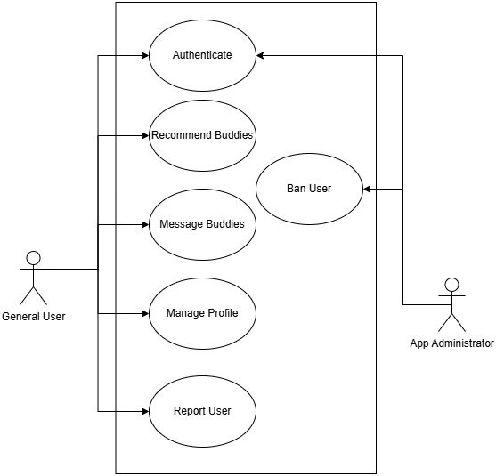
Authenticate -> Update profile - Amanvir
Find jog buddies - use smart recommendation system - Vinny
Message
Manage profile
Report users - William
Ban Users (admin side) - William


### **3.2. Actors Description**
1. **User**: A person who uses the app to locate and connect with others users nearby, ultilizes leaderboards and update their personal information.
2. **App Admin**: A person who has higher privileges to moderate the app by reviewing reports from users and issues bans to offenders.

### **3.3. Functional Requirements**

1. **User Authentication**:<a id="fr1"></a>
   1. **Sign Up**:
        - **Description**: This feature allows users to create an account on the app using Google Sign In API.
        - **Primary actor(s)**: User
        - **Main success scenario**:
            1. User enters credentials in Google Sign In
            2. The system generates a token for the user
            3. The user is added to the User DB 
            4. User gets confirmation the sign up was successful
            5. New session is started
        - **Failure scenario(s)**:
            - 1a. Invalid email:
                - 1a1. An error message is displayed telling user of the error
                - 1a2. App prompts user to re-enter a valid email
            - 3a. Unable to connect to server to add User
                - 3a1. An error message is displayed telling user of the error
                - 3a2. App prompts user to try again after a set time period
    2. **Sign Up**: 
        - **Description**: This feature allows users to log in to an existing account on the app using Google Sign In API.
        - **Primary actor(s)**: User
        - **Main success scenario**:
            1. User enters credentials in Google Sign In
            2. The system fetches a token for the user
            3. System checks User is in the Database
            4. A new session is created for the user 
            5. User gets confirmation the Login was successful
        - **Failure scenario(s)**:
            - 3a. Unable to connect to server to check User data in DB
                - 3a1. An error message is displayed telling user of the error
                - 3a2. App prompts user to try again after a set time period
    3. **Sign Out**:
        - **Description**: This feature allows users to log out from the app and close their current session.
        - **Primary actor(s)**: User
        - **Main success scenario**:
            1. User clicks sign out button
            2. System uses User token and sessionID to close user session
            3. User gets confirmation the Sign Out was successful and is taken back to login screen
        - **Failure scenario(s)**:
            - 2a. Unable to connect to close user session due to network problems
                - 2a1. An error message is displayed telling user of the error
                - 2a2. App prompts user to try again after a set time period

2. **Update profile**:<a id="fr2"></a>
   - **Description**: This feature allows users to update their profile to help personalize their nearby buddy recommendations.
   - **Primary actor(s)**: User
   - **Main success scenario**:
       - 1. User navigates to the profile section.
       - 2. User inputs their personal information and jogging preferences.
       - 3. User clicks on the "Save" button.
       - 4. System updates the user's profile in the database.
   - **Failure scenario(s)**:
       - 2a. Invalid input: 
            - 2a1. System displays error message saying invalid character is entered.
            - 2a2. App prompts user to input valid information.
       - 4b. Network issue: 
            - 4a1. Information are not saved and system displays error message saying "Network error. Please check your internet connection and try again."
            - 4a2. App prompts user to try again after a set time period.

3. **Recommend Jogger Buddies**:<a id="fr3"></a>
    - **Description**: This feature allows users to discover other joggers nearby based on their location and preferred jogging time.
    - **Primary actor(s)**: User
    - **Main success scenario**:
        - 1. User navigates to the "Find Joggers Nearby" section.
        - 2. User click on the "Find Joggers" button.
        - 3. System retrieves and displays a list of available joggers nearby along with relevant details (e.g., name, experience level, jogging pace, availability).
    - **Failure scenario(s)**:
        - 3a. No suitable matches are found: 
            - 3a1. System displays message saying "No joggers available for the selected time and location. Please try again later or adjust your preferences."
            - 3a2. App prompts user to try again after adjusting preference.
        - 3b. Database error: 
            - 3b1. System displays error message saying "Unable to retrieve joggers. Please try again later."
            - 3b2. App prompts user to try again after a set time period.
        - 3c. Network issue: 
            - 3c1. System displays error message saying "Network error. Please check your internet connection and try again."
            - 3c2. App prompts user to try again after a set time period.

4. **Join/Create and send message to Chat Group**:<a id="fr4"></a>
    1. Join/Create to Chat Group
        - **Description**: This feature allows users to join or create a chat group with other users when looking at the profile of other joggers.
        - **Primary Actors**: User(s)
        - **Main Success Scenario**:
            1. User clicks on an User Profile
            2. User sends a connection request or message to create a chat or join a group chat with the jogger.
            3. If the jogger accepts, the system confirms the connection, allowing further communication.
        - **Failure Scenarios**:
        - 2a. Jogger/Group does not exist: Display "Error: Group/Jogger does not Exist"
        - 2b. User is not logged in: Display "Error: Please Log in again"
        - 3a. Jogger/Group Reports user attempting to join: "Error: Could not connect with Joggers"
    2. Send message
        - **Description**: This feature allows users to message other users.
        - **Primary Actors**: User(s)
        - **Main Success Scenario**:
            1. User enters message into textbox and clicks send
            2. System ensures message contains valid content
            3. System sends the message to the recipient(s) with WebSocket
            4. System takes message and stores it in message DB
            5. System confirms to User the message was delivered successfully and updates displayed messages
        - **Failure Scenarios**:
            - 2a. Invalid content in message
                - 2a1. An error message is displayed telling user of the error
                - 2a2. User is prompted to re-enter message with valid characters
            - 3a. Message can not be sent due to network issues
                - 3a1. An error message is displayed telling user of the error
                - 3a2. User is prompted to try again after a set period of time

5. **Report Users**<a id="fr5"></a>:
   - **Description**: Users can report inappropriate behavior or content within the app. This report is sent to the admin panel for further review.
   - **Primary actor(s)**: User
   - **Main success scenario**:
       1. User navigates to the profile or message thread of the offending user.
       2. User selects the "Report" option.
       3. User chooses a reason from a predefined list (e.g., harassment, spam, inappropriate content).
       4. User submits the report.
       5. System confirms submission and stores the report in the database.
       6. Admin is notified of the new report.
   - **Failure scenario(s)**:
       - 1a. No internet connection: Display "Failed to submit report. Please try again."
       - 1b. Report submission error: Display "An error occurred. Please try again later."

6. **Ban Users (Admin Side)**:<a id="fr6"></a>
   - **Description**: Admins have the capability to ban users who have been reported for violations, ensuring a safe and friendly community environment.
   - **Primary actor(s)**: App Admin
   - **Main success scenario**:
       1. Admin logs into the admin panel.
       2. Admin reviews a list of reported users with details of the reports.
       3. Admin selects a user to ban.
       4. Admin clicks the "Ban User" button.
       5. System updates the user's status to "Banned" and restricts access to the app.
       6. User receives a notification or email explaining the reason for the ban.
   - **Failure scenario(s)**:
       - 1a. Database error: Display "Failed to ban user. Please try again later."
       - 1b. Unauthorized access: Display "You do not have permission to perform this action."


### **3.4. Screen Mockups**


### **3.5. Non-Functional Requirements**
<a name="nfr1"></a>

1. **Security**  
    - **Description**: The application will ensure that user data and communications are encrypted, and secure protocols (e.g., HTTPS) will be used.
    - **Justification**: Security is a key aspect of any application that handles user data. It ensures that users' personal information is protected from unauthorized access and potential breaches. This is crucial for building trust and maintaining user confidence in the application.
2. **Finding Buddies Performance** 
    - **Description**: The finding Buddies buddies functionality must respond with a list of nearby joggers in at most 15 seconds.
    - **Justification**: The finding application must be responsive and having customers wait for long periods of time negatively affetcts their experience as an user. Therefore, it is important to ensure that the most complex functionality is capped to a reasonable response time. To improve performance, when the functionality is taking too long, it might return the list with the remaining users  unsorted or return a shorter list of found users.


## 4. Designs Specification
The design focuses on enabling the general user to
### **4.1. Main Components** 
1. **Users**
    - **Purpose**: Provide authentication, manage sessions, manage passwords, and ensure users can only access resources they have permission for. 
    - **Interfaces**:
        1. **`Tkn Login(Email, password)`**:
            - **Purpose**: Returns a valid token to keep session with the user if the user is able to successfully authenticate.
        2. **`Tkn Token(auth_code: string)`**:
           - **Purpose**: Get an authentication token directly from Google Oauth. 
        3. **`bool checkCredentials(token: Tkn)`**:
            - **Purpose**: Check that the token given by Google Oauth is valid.
        4. **`int LogoutUser()`**:
            - **Purpose**: Ends user session by invalidating session token.
        5. **`updateUserPreferences(userId: int, newPreferences: Tuple(Profile, Schedule), tkn: Tkn)`**:
           - **Purpose**: Updates User Profile and Schedule. 
        6. **`bool checkCredetials(userId: int, tkn Tkn)`**:
        - **Purpose**: Check that the user is logged in and holding a valid session id.
        1. **`bool addUserToChatGroup(userId: int, chatId: int, tkn)`**:
        - **Purpose**: adds an user to the chat described by the chatId to the user's profil.
        1. **`bool addUsersToChatGroup(userId: int, budId: int, chatId: int, tkn)`**:
        - **Purpose**: adds the chat described by the chat Id to both user profiles.
2. **Messaging** 
    - **Purpose**: Allow users to communicate with potential jogging partners and discuss meeting time, place, etc. and set up groups
    - **Interfaces**: 
        1. **`Chat *createNewChat(String myId, String budId)`**
        - **Purpose**: Creates a new chat object, to manage the chat between the current User (myId) and the User they want to message (budId)
        2. **`Bool addUserToChatGroup(String myId, String budId, String chatId, tkn)`**
        - **Purpose**: Adds user "myId" and "budId" to a chat Object with the "chatId"
        3. **`Bool deleteChat(String chatId)`**
        - **Purpose**: Deletes Chat with Id matching "chatId"
        4. **`Bool addUserToChat(String myId, String chatId)`**
        - **Purpose**: Adds user to Chat with Id matching "chatId" 
        5. **`Bool ValidateMessage(String Message)`**
        - **Purpose**: Checks if "Message" has any invalid characters in it
        6. **`Bool SendMessage(String UserId, String ChatId, String Message)`**
        - **Purpose**: Sends "Message" using WebSocket to all Users in chat with id, "ChatId"
        7. **`Bool AddMessageToChat(String UserId, String ChatId, String Message)`**
        - **Purpose**: Stores "Message" in the Messaging DB
        
3. **Recommendations** 
    - **Purpose**: Provide users with a list of potential jogging partners based on their preferences and location.
    - **Interfaces**: 
        1. **`bool authenticated(String userId, String tkn)`**
        - **Purpose**: Validates the user’s authentication token before processing their request.

        2. **`List<Profile> findJoggersNearby(Location location, double maxUsers)`**
        - **Purpose**: Retrieves joggers located within a specified distance from the user.

        3. **`List<Profile> findBestSuitedJoggers(UserProfile profile, List<Profile> nearbyUsers)`**
        - **Purpose**: Applies a matching algorithm to rank and return the most compatible jogger profiles for the user.


### **4.2. Databases**
1. **Users DB**
    - **Purpose**: To store user credentials, running preferences, and running performance.
    - **Representation**: The user database will store the User object which includes both General Users and Admin as depicted in the class diagram below:
<div align="center">
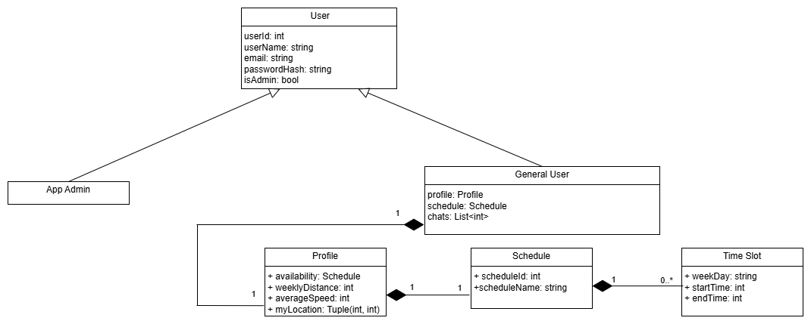
</div>


2. **Messaging DB**
    - **Purpose**: To store chat logs and metadata.
    - **Representation**: The database will store Chat objects as depicted in the following class diagram:

<div align="center">
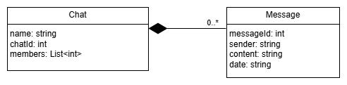
</div>


### **4.3. External Modules**
1. **Google Sign in API** 
    - **Purpose**: To provide user authentication service.
1. **Google Map API** 
    - **Purpose**: To provide location services and map functionalities.
    

### **4.4. Frameworks**
1. **Microsoft Azure**
    - **Purpose**: It is our cloud provider, used to host our server.
    - **Reason**: We want to experiment with it and learn about using it as usually it costs a lot of money but we have access to it for free.
2. **MongoDB**
    - **Purpose**: It will be used for our all of our databases
    - **Reason**: It is dynamic and always you to retrieve objects as JSON, additionally MongoDB has better performance than most other database options we have access to.
2. **ExpressJS**
    - **Purpose**: We will use it to build RESTful APIs
    - **Reason**: It allows us to easily and rapidly set up a REST API. Also it is lightweight and works with MongoDB,

### **4.5. Dependencies Diagram**

<div align="center">
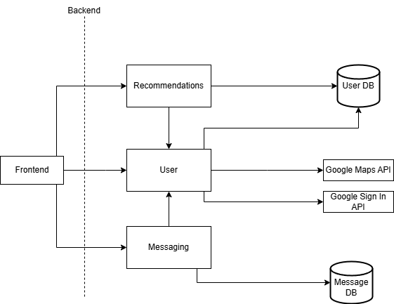
</div>


### **4.6. Functional Requirements Sequence Diagram**
1. [**User Authentication**](#fr1)
- [**User Login/Sign up**](#f1)
<div align="center">
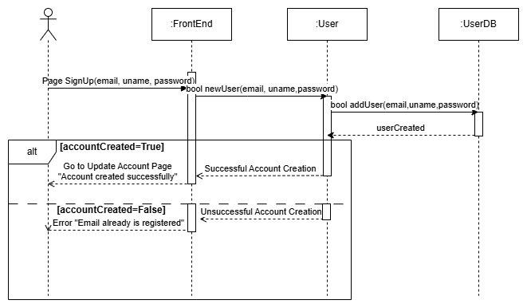
</div>

- [**User Sign out**](#fr1)
<div align="center">
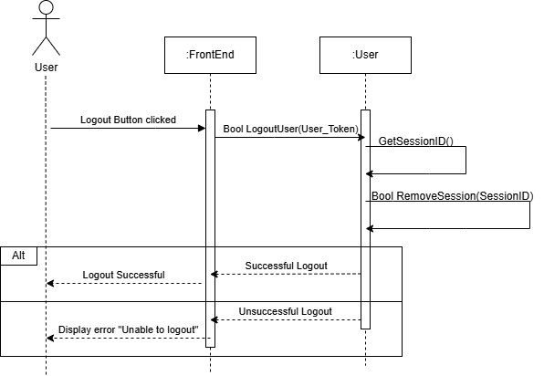
</div>

2. [**Update Profile**](#fr2)

<div align="center">

</div>

3. [**Recommend Jogging Buddies**](#fr3)
<div align="center">
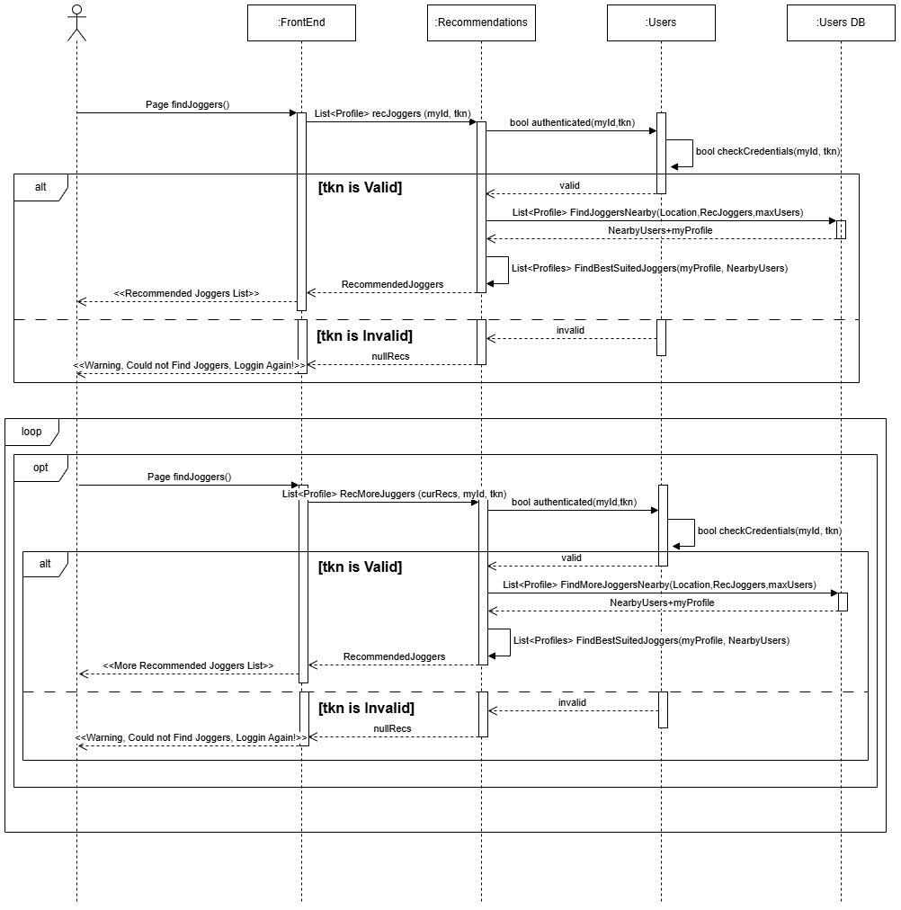
</div>

4. [**Join/Create and Send Messages to Chat Group**](#fr4)
- [**Join/Create Chat Group**](#fr4)
<div align="center">
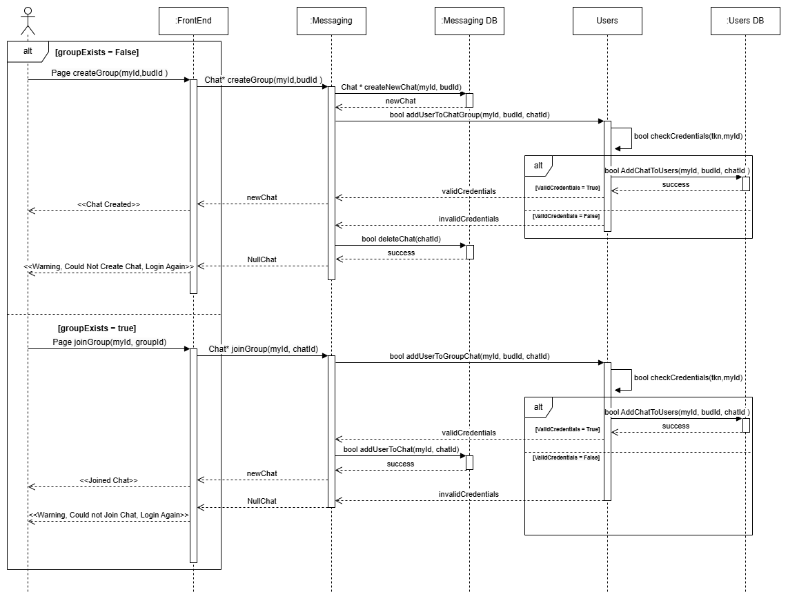
</div>

- [**Send Messages to Chat Group**](#fr4)
<div align="center">
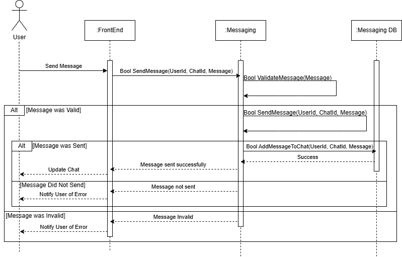
</div>

5. [**Report Users**](#fr5)
<div align="center">
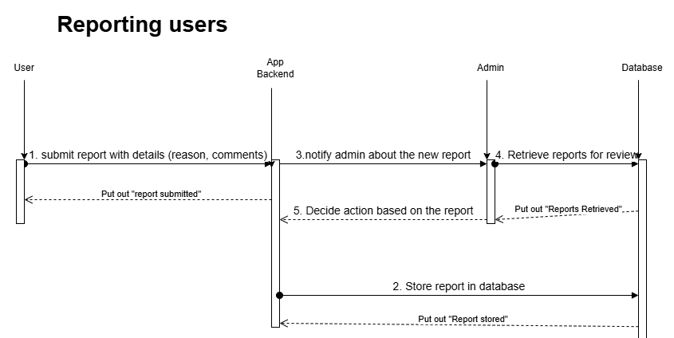
</div>

6. [**Ban Users**](#fr6)
<div align="center">
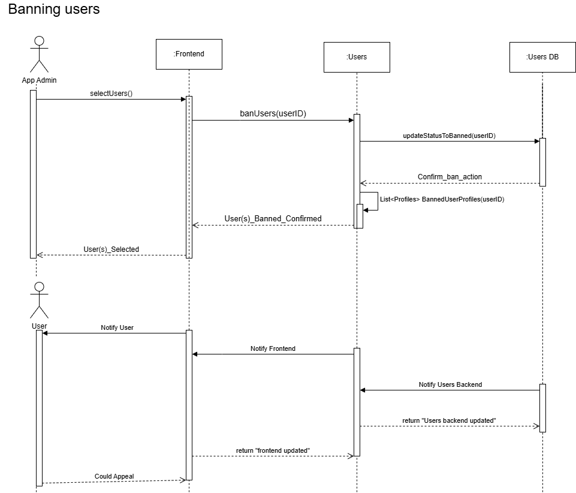
</div>


### **4.7. Non-Functional Requirements Design**
1. [**Security: Encryption of user data**](#nfr1)
    - **Validation**: All user data and communications will be encrypted using HTTPS to ensure secure data transmission. Passwords will be securely hashed before storage, and database encryption will be applied for sensitive information. 
2. [**Performance: Find Buddies Does must not take more than 15s**](#nfr2)
    - **Validation**: The time algorithm  for finding buddies will be capped to 12 seconds and will be constrained to selecting at most ten profiles from a list of at most 100 users. In addition, the front end will have a timer and return failure if no response is received by those 15 seconds. This will ensure that in case of losing connection, there is a timeout for reconnection attempts.


### **4.8. Main Project Complexity Design**
**Jogger Recommendation System**
- **Description**: The jogger recommendation system helps users find compatible running partners based on location, jogging speed, and preferred running time. The system processes user profiles and ranks potential jogging buddies using a weighted scoring mechanism. The recommendation process needs to be efficient, scalable, and provide relevant matches in real-time.

- **Why complex?**: 
    - Geospatial Calculations: The system must compute distances between users using latitude and longitude, requiring efficient algorithms like the Haversine formula.
    - Multi-Factor Matching: Users are not just matched based on distance but also jogging speed and time compatibility, requiring multi-variable optimization.
    - Efficient Sorting & Filtering: Since the system might need to process thousands of users, ranking and filtering must be optimized.
    - Scalability: As more users join, the system must handle increased computations without degrading performance.

- **Design**:
    - **Input**: 
        - ShortListedBuddies: List of user profiles filtered by basic constraints (e.g., active users, within a certain radius).
        - UserLocation: The latitude and longitude of the user.
        - UserAvaliability: A schedule that shows times the user is available throughout the week.
        - UserSpeed: The user’s average jogging speed.
    - **Output**: 
        - A list of the top 5 best-matched jog buddies, ranked based on a computed match score.
    - **Main computational logic**: 
        - Distance Calculation: Uses the Haversine formula to compute the real-world distance between the user and each buddy.
        - Time and Speed Compatibility: Calculates the absolute difference in preferred jogging time and speed.
        - Scoring System: Assigns weighted scores based on proximity, time similarity, and speed similarity.
        - Sorting and Selection: Ranks the top 5 most compatible jogging partners.

    - **Pseudo-code**: 

```
Algorithm findJogBuddies(ShortListedBuddies, userLocation, userAvailability, userSpeed)
    Input: 
        ShortListedBuddies (List of profiles)
        userLocation (latitude, longitude)
        userAvailability
        userSpeed
    Output: 
        Top 5 best-matched jog buddies

    Define matches as an empty list

    For each buddy in ShortListedBuddies:
        Calculate distanceScore = calculateDistance(userLocation, buddy.location)
        Calculate timeDifference = abs(userAvailability - buddy.Availability)
        Calculate speedDifference = abs(userSpeed - buddy.speed)

        If timeDifference ≤ thresholdTime AND speedDifference ≤ thresholdSpeed:
            Compute matchScore = (1 / (1 + distanceScore)) * weightLocation + 
                                (1 / (1 + timeDifference)) * weightTime + 
                                (1 / (1 + speedDifference)) * weightSpeed

            Add (buddy, matchScore) to matches list

    Sort matches in descending order by matchScore

    Return top 5 buddies from matches (if available)
End Algorithm

Function calculateDistance(location1, location2)
    Input: 
        location1 (lat1, lon1)
        location2 (lat2, lon2)
    Output: 
        Distance between two locations in km

    Apply Haversine Formula:
        R = 6371 (Earth’s radius in km)
        dLat = toRadians(lat2 - lat1)
        dLon = toRadians(lon2 - lon1)

        a = sin²(dLat / 2) + cos(toRadians(lat1)) * cos(toRadians(lat2)) * sin²(dLon / 2)
        c = 2 * atan2(sqrt(a), sqrt(1-a))

    Return R * c
End Function
```


## 5. Contributions
- Alfredo del Rayo:
  - Use-Case Diagram
  - Use-Case Description: 
    - Find Joggers Nearby and Create/Join Chat
    - Corresponding Sequence Diagram
  - Non functional Requirement:
    - Performance 
  - Main Component:
    - User Management
- Amanvir Samra
    - Completed Main Actor section, User Authentication and Messaging Functional Requirements and Sequence Diagrams. Also did the Messaging Main Component description and Frameworks section. I've spent approxiametly 5 hours on the project.
- Yu Qian Yi
  - I contributed to the project by designing and implementing the Update Profile and Find Joggers Nearby functionalities, including their sequence diagrams, database structure, and external module interactions. Additionally, I ensured non-functional requirements such as security were met, developed pseudocode for the recommendation algorithm, and defined key interfaces for the Recommendation component. I've spent approximately 3 to 4 hours to complete and refine M3 project.
- William Sun
  - Functional Requirements and sequence diagram (4.6)
    - reporting users
    - banning users
  - Main Components - Leaderboard
  - 4.8
