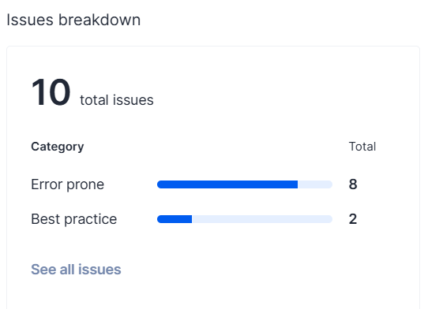

# Example M5: Testing and Code Review

## 1. Change History

| **Change Date**   | **Modified Sections** | **Rationale** |
| ----------------- | --------------------- | ------------- |
| 04/02/2025 | 3.2. Test Verification and Logs | Updated the non-functional requirement according to M5 feedback
| 04/02/2025 | 4.2. Tests | Updated the recommendation use case as weight of availability input is added

---

## 2. Back-end Test Specification: APIs

### 2.1. Locations of Back-end Tests and Instructions to Run Them

#### 2.1.1. Tests

| **Interface**                 | **Describe Group Location, No Mocks**                | **Describe Group Location, With Mocks**            | **Mocked Components**              |
| ----------------------------- | ---------------------------------------------------- | -------------------------------------------------- | ---------------------------------- |
| **POST /recommendations/:email** | [`backend/tests/no-mocks`
`/recommendationControllers.test.ts`](#) | [`backend/tests/mocks/recommendationControllers.mock.test.ts`](#) | Mongo DB failure |
| **POST /api/users/location/:email** | [`backend/tests/no-mocks`
`/recommendationControllers.test.ts`](#) | [`backend/tests/mocks/recommendationControllers.mock.test.ts`](#) | Mongo DB failure |
| **GET /chat/:email** | [`backend/tests/no-mocks`
`/messagingControllers.test.ts`](#) | [`backend/tests/mocks/messagingControllers.mock.test.ts`](#) | Mongo DB failure |
| **GET /chat/:email** | [`backend/tests/no-mocks`
`/messagingControllers.test.ts`](#) | [`backend/tests/mocks/messagingControllers.mock.test.ts`](#) | Mongo DB failure |
| **GET /chat/:chatId** | [`backend/tests/no-mocks`
`/messagingControllers.test.ts`](#) | [`backend/tests/mocks/messagingControllers.mock.test.ts`](#) | Mongo DB failure |
| **GET /chat/messages/:chatId/:messageId** | [`backend/tests/no-mocks`
`/messagingControllers.test.ts`](#) | [`backend/tests/mocks/messagingControllers.mock.test.ts`](#) | Mongo DB failure |
| **GET /chat/members/:chatId** | [`backend/tests/no-mocks`
`/messagingControllers.test.ts`](#) | [`backend/tests/mocks/messagingControllers.mock.test.ts`](#) | Mongo DB failure |
| **POST /chat/:email** | [`backend/tests/no-mocks`
`/messagingControllers.test.ts`](#) | [`backend/tests/mocks/messagingControllers.mock.test.ts`](#) | Mongo DB failure |
| **POST /chat/message/:chatId**| [`backend/tests/no-mocks`
`/messagingControllers.test.ts`](#) | [`backend/tests/mocks/messagingControllers.mock.test.ts`](#) | Mongo DB failure |
| **POST /chat/dm/:email** | [`backend/tests/no-mocks`
`/messagingControllers.test.ts`](#) | [`backend/tests/mocks/messagingControllers.mock.test.ts`](#) | Mongo DB failure |
| **PUT /chat/:email** | [`backend/tests/no-mocks`
`/messagingControllers.test.ts`](#) | [`backend/tests/mocks/messagingControllers.mock.test.ts`](#) | Mongo DB failure |
| **GET /User/:email** | [`backend/tests/no-mocks`
`/userControllers.test.ts`](#) |
| **PUT /User/:email** | [`backend/tests/no-mocks`
`/userControllers.test.ts`](#) | [`backend/tests/mocks/userControllers.mock.test.ts`](#) | Mongo DB failure |
| **POST /api/v1/auth/google** | [`backend/tests/no-mocks`
`/userControllers.test.ts`](#) | [`backend/tests/mocks/userControllers.mock.test.ts`](#) | Mongo DB failure & google-auth-library |

#### 2.1.2. Commit Hash Where Tests Run

 `90f791b3c71aff908a52c9293fd24820235095a6`

#### 2.1.3. Explanation on How to Run the Tests
All Backend Tests are located under  `backend/tests`

We assume that you have MongoDB installed and running in your machine.

First clone the reporsitory as follows:
```sh
git clone https://github.com/TrailBlazersInc/TrailBlazers.git Trailblazers
```
Then cd into `Trailblazers/backend` directory, and create an .env file with the following properties:
```sh
DB_URI: mongodb://localhost:27017/tests
PORT: 3000
GOOGLE_CLIENT_ID: << "Your GOOGLE CLIENT ID" >> 
JWT_SECRET: helloWorld
IS_TESTING: true
```
Make sure to replace << Your GOOGLE CLIENT ID >> with your own google OAuth web client ID. Then to start the test run the following commands:
```sh
npm install
npx ts-jest config:init 
npm test # Make sure to add the .env file before running this command
```

### 2.2. GitHub Actions Configuration Location

`.github/workflows/backendTests.yml`

### 2.3. Jest Coverage Report Screenshots With Mocks


Please note that our team was not required to test BanControllers, BanRoutes, ReportRoutes, nor ReportControllers due to team reduction.

### 2.4. Jest Coverage Report Screenshots Without Mocks


Please note that our team was not required to test BanControllers, BanRoutes, ReportRoutes, nor ReportControllers due to team reduction.

---

## 3. Back-end Test Specification: Tests of Non-Functional Requirements

### 3.1. Test Locations in Git

| **Non-Functional Requirement**  | **Location in Git**                              |
| ------------------------------- | ------------------------------------------------ |
| **Recommendation Usability** | [`android_app/app/src/androidTest/java/com/example/cpen321project/RecommendationTest.kt#L109`](#) |
| **Performance (Profile Preferences Updates Response Time)** | [`android_app/app/src/androidTest/java/com/example/cpen321project/ManageProfileTest.kt`](#) |

### 3.2. Test Verification and Logs

- **Recommendation Usability**

  - **Verification:** This test suite simulates a user request to ensure that at least one valid jogging buddy is displayed. The focus is on verifying the correct parsing of user preferences for location, speed, distance, and availability to the backend. The matching algorithm is then executed, and the UI must successfully display the most suitable jogging partner. We use Espresso's onView().check(matches(isDisplayed())) to confirm that a recommendation appears on the screen. The test logs will indicate whether the system successfully returns a match for the user.

  - **Log Output**
    ```
    Test 3: Successfully displayed a recommended jogging buddy!
    ```

- **Manage Profile Usability**
  - **Verification:** This test suite simulates updated the pace number entry and saving the changes to your profile. The focus of this test is on parsing updated user information to the backend and updating the database. The test lets us know if the system is executed within our expected response time.
  - **Log Output**
    ```
    Response Time: $responseTime ms
    Test 2: Successfully checked response time for updated profile
    ```

---

## 4. Front-end Test Specification

### 4.1. Location in Git of Front-end Test Suite:

`android_app/src/androidTest/java/com/cpen321project/`

### 4.2. Tests

- **Use Case: Login**

- **Use Case: Message**

  - **Expected Behaviors:**

    | **Scenario Steps** | **Test Case Steps** |
    | ------------------ | ------------------- |
    | 1. User Enters the Chat Overview               | click button "My groups in the main page" |
    | 2. User Selects Chat | click on the first DM chat available from the overview |
    | 3. User enters message into the textbox and clicks on send | Input a "hello, howe are you?" and click send |
    | 4. Message is displayed on the chat | Assert that a new message with content hello, howe are you?" is displayed |

  - **Test Logs:**
    

- **Use Case: Manage Profile**

  - **Expected Behaviors:**

    | **Scenario Steps** | **Test Case Steps** |
    | ------------------ | ------------------- |
    | 1. User enters the Manage Profile Overview. | Click button "Manage Profile" at HomeActivity and it will navigate to ManageProfile. |
    | 2a. User inputs invalid number for pace and tries to save changes. | Enter 25.0 into the text field for pace and click "Save Changes" button.  |
    | 2a1. The app shows an error message prompting the user for a correct value. | Check dialog is opened with text: “Please enter a valid pace”.  |
    | 2. User inputs valid pace. | Enter a randomly generated number from 1.0 to 20.0 into the text field for pace. |
    | 3. User presses the save button. | Click "Save Changes" button. |
    | 4. The app shows a message telling the user the changes were changed successfully. | Check dialog is opened with text: “Please enter a valid pace”. |
  - **Test Logs:**

- **Use Case: Recommendation**

  - **Expected Behaviors:**

    | **Scenario Steps** | **Test Case Steps** |
    | ------------------ | ------------------- |
    | 1. User enters the Recommendation Overview. | Click button "Recommendation" at HomeActivity and it will navigates to RecommendationActivity. |
    | 2a. User inputs invalid weight for location, speed, distance and availability respectively. | Enter abc, def, ghi and jkl respectively.  |
    | 2. User inputs valid weight for location, speed, distance and availability respectively. | Enter 5, 6, 7 and 8 respectively. |
    | 3. User grants location permission. | Click "Grant Location Permission" button. |
    | 4. User get recommendation list. | Click "Get Recommendations" button and the most matched jogger recommendation will be displayed. |
    | 5. User can see it's location (and location of jogger if they are nearby)  | Click "View on Map" button and it will navigate to MapActivity. |
    | 6. User can direct message jogger | Click "Message" button and it will navigate to ChatActivity. |
  - **Test Logs:**
    

---

## 5. Automated Code Review Results

### 5.1. Commit Hash Where Codacy Ran

`90f791b3c71aff908a52c9293fd24820235095a6`

### 5.2. Unfixed Issues per Codacy Category



### 5.3. Unfixed Issues per Codacy Code Pattern
  1. **@typescript eslint: [No explicit any](#)**
  
  2. **Too many functions inside a/an file/class/object/interface always indicate a violation of the single responsibility principle. Maybe the file/class/object/interface wants to manage too many things at once.**
  
  3. **Promises must be awaited, end with a call to .catch, end with a call to .then with a rejection handler or be explicitly marked as ignored with the `void` operator.**
  


### 5.4. Justifications for Unfixed Issues

  1. **@typescript eslint: [No explicit any](#)** 
  - **Location in Git:** [`backend/index.ts`](#)
  - **Justification:** Since we are using exclusively our own routes and do not need to fetch it from some outter source and we are doing this only to set up the server, it is not necessary to heavily type the express application.
  
  - **Location in Git:** [`backend/middleware/authMiddleware.ts`](#)
   - **Justification:** Since this is middleware we want the response to be fast so it doesn't slow down the response time of the requests. By using any we are prioritizing speed and since we are not using strict mode in our typescript config it is unnecessary to add type safety to any.
  

  2. **Too many functions inside a/an file/class/object/interface always indicate a violation of the single responsibility principle. Maybe the file/class/object/interface wants to manage too many things at once.**

     - **Location in Git:** [`android_app/app/src/main/java/com/example/cpen321project/APIService.kt`](#)
     - **Justification:** ApiService is used for all of our API request functions, we can not reduce the amount of API request functions we have for it.


  3. **Promises must be awaited, end with a call to .catch, end with a call to .then with a rejection handler or be explicitly marked as ignored with the `void` operator.**
     - **Location in Git:** [`backend/index.ts`](#)
     - **Justification:** Since the try catch is already handled inside the function, and it is only used to start the server, there is no need to specify void on startServer().

  4. **Forbidden non-null assertion.**

     - **Location in Git:** [`backend/controllers/RecommendationController.ts`](#)
     - **Justification:** I tried to resolve this non-null assertion issue by adding an if statement to return null when `userScores` is empty but the return null line of code is not covered in jest test. This means that `userScores` will never be null. Hence, I think this is a false positive by Codacy.

  4. **Forbidden non-null assertion.**

     - **Location in Git:** [`backend/controllers/RecommendationController.ts`](#)
     - **Justification:** I tried to resolve this non-null assertion issue by adding an if statement to return null when `proposerPrefs` is empty but the return null line of code is not covered in jest test. This means that `proposerPrefs` will never be null. Hence, I think this is a false positive by Codacy.

  5. **Forbidden non-null assertion.**

     - **Location in Git:** [`backend/controllers/RecommendationController.ts`](#)
     - **Justification:** I tried to resolve this non-null assertion issue by adding an if statement to return null when `proposalCount` is empty but the return null line of code is not covered in jest test. This means that `proposalCount` will never be null. Hence, I think this is a false positive by Codacy.
